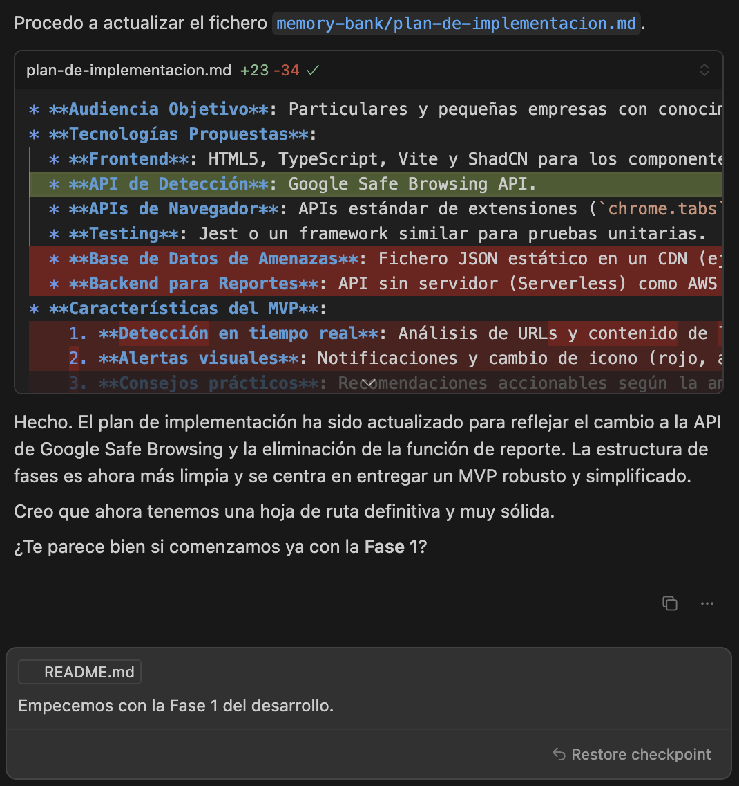
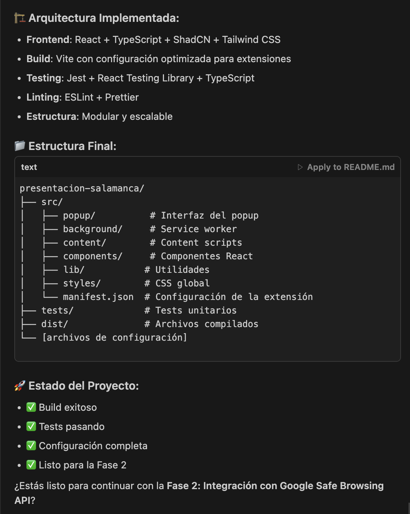
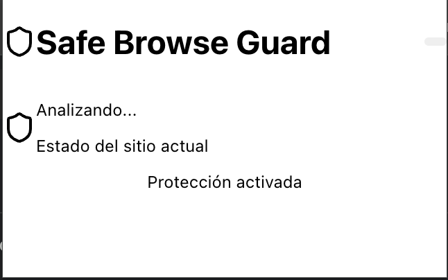
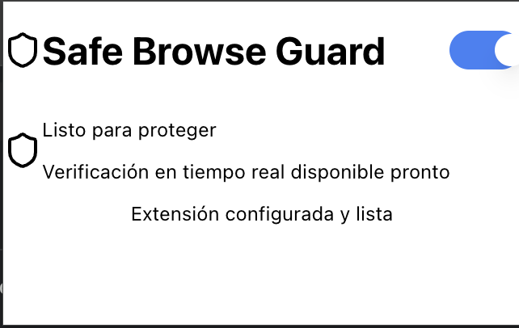
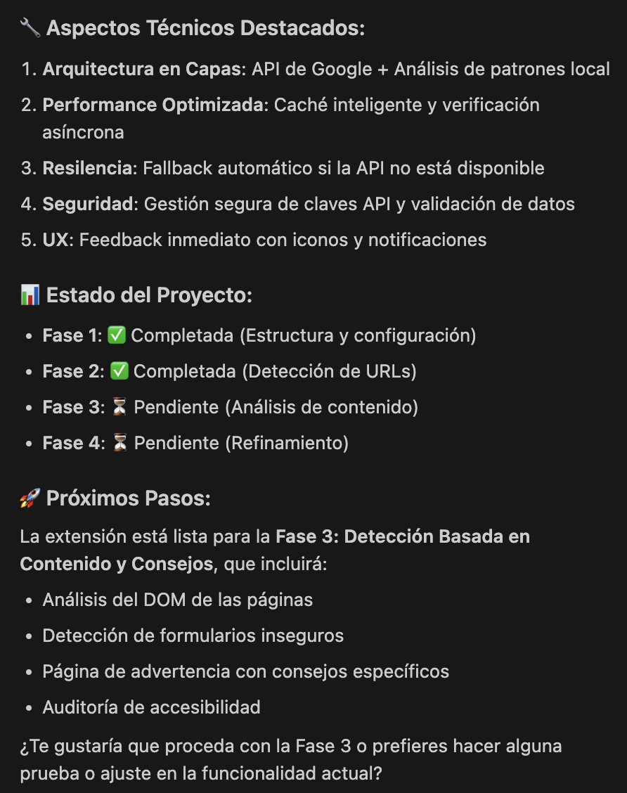

# Desarrollando una idea con IA partiendo de cero

En este repo muestro cómo he ido construyendo una idea de principio a fin para una presentación sobre programación con IA partiendo de cero.

## Paso 0: Definir el producto

Le he pedido ideas para solucionar problemas actuales mediante software. Para ello, he empleado este _prompt_:
> Quiero desarrollar un emprendimiento. ¿Cuáles consideras que son las principales necesidades que actualmente puede haber en el mercado para desarrollar un MVP con software?

**Idea seleccionada**: "Una extensión de navegador que detecte sitios web sospechosos en tiempo real y ofrezca consejos prácticos para evitar estafas."

## Paso 1: Definir el producto

Le he pedido que desarrolle una pequeña _prompt_ con la descripción y las características principales del proyecto, para luego colocarlo en el primer documento del banco de memoria: `./memory-bank/sobre-el-producto.md`.

> Escribe un prompt pequeño con la descripción del proyecto y las características principales para este MVP: "Una extensión de navegador que detecte sitios web sospechosos en tiempo real y ofrezca consejos prácticos para evitar estafas."

## Paso 2: Establecer el plan de implementación

He creado un fichero llamado `./memory-bank/plan-de-implementacion.md` y le he pedido `Gemini 2.5 Pro Thinking` que me desarrolle un plan de implementación y lo incorpore al banco de memoria.

> Con base en @sobre-el-producto.md y teniendo en consideración las características allí descritas, quiero que desarrolles un plan de implementación y lo escribas en @plan-de-implementacion.md con pasos mínimos necesarios para empezar a incorporar funcionalidades y alcanzar el MVP.
>
> <contenido>
> El plan de implementación debe tener:
> <descripcion-del-proyecto>
> Un pequeño preámbulo con la descripción del proyecto y la audiencia objetivo, describiendo las tecnologías necesarias para construirlo, las principales características del MVP, buenas prácticas a aplicar e instrucciones para el despliegue
> </descripcion-del-proyecto>
> <fases-del-plan>
> El plan de implementación debe contener una guía paso a paso detallada, con pequeñas tareas realizables separadas por fases
> </fases-del-plan>
> <despliegue>
> El plan de implementación también debe considerar un despliegue ágil y rápido tanto del MVP como de las consiguientes actualizaciones mayores
> </despliegue>
> </contenido>
>

El plan estaba bien planteado, así que lo acepté, aunque le pedí que revisara nuevamente el documento inicial porque faltaban algunos aspectos. Luego, le pedí que empleáramos Vite y Typescript en lugar de Javascript, y ShadCN en lugar de CSS3 puro. Y, finalmente, opté por pedirle que cambiara la estrategia, de tener una blacklist propia a que consultara la API de Google Safe Browsing de Google.

Así finalicé con el refinamiento de la primera versión del Plan de implementación.

Cabe acotar que yo tenía un conjunto de [Reglas de Usuario](https://docs.cursor.com/context/rules) predefinidas en mi editor de código y eso también ha influido en aspectos planteados en el Plan de Implementación.

## Paso 3: Implementación de la Fase 1

La Fase 1 fue ejecutada totalmente por la IA. Mi única intervención se limitó a decirle a la Terminal que no corrigiera el comando `npm test` que la Terminal sugería con una 's'. 😅

Repitió varias veces un ciclo, relacionado con tests fallidos, y finalmente la cumplimentó.

### Probando el resultado de la Fase 1

Luego, le pedí que me explicara cómo probar la extensión en esta primera fase y me dio todas las instrucciones.

La extensión sólo mostraba un cuadro blanco, así que le reporté:
> La extensión está instalada y activa, pero al presionar sobre ella sólo muestra un pequeño cuadro blanco.

Fuimos iterando correcciones, hasta que finalmente se pudo ver algo. Aunque con ciertos fallos estéticos. Así que le indiqué el problema adjuntándole la imagen.

Luego de algunas iteraciones y pasarle capturas, logramos un resultado que cumplía con lo previso para la Fase 1.

Finalmente, le indico que quiero que verifique el Plan de Implementación y que actualice su estado si se ha cumplido con todo lo previsto en la Fase 1.

En total, fueron como 1 o 2 horas de trabajo (interrumpidas). Al comienzo estuvo unos 10 minutos configurando todo y luego otros 10 escribiendo todo. Más las pruebas y revisiones posteriores.

## Paso 4: Implementación de la Fase 2

Le pedí que procediera con la segunda fase. Estuvo desarrollando todo el código y la lógica durante unos 10-15 minutos más.

Ahora, la extensión se conecta con Google Safe Browsing API y también evalúa patrones de nombre de URL, mostrando un pequeño indicador según si el sitio web es seguro o no.

En total, con las pruebas realizadas en el navegador. Diría que no pasó más de media hora desde que le dije que empezara esta fase.

Como curiosidad, esta vez decidió actualizar el Plan de Implementación por su cuenta, para lo que le he indicado que:
> No actualices el plan de implementación hasta que te indique que todo está correcto.

Principalmente, por poder revisar que todo anda bien en el navegador, ya que previamente fue el punto donde se presentaron fallos. Y, como me parecía una norma a mantener, decidí incorporarla como un [Regla de Proyecto](https://docs.cursor.com/context/rules) específica del banco de memoria, por lo que la coloqué en `./memory-bank/.cursor/rules/plan-de-implementacion.mdc`.
